# A guide to maintaining this repo

This document is a step by step guide to the maintenance of the S1_S2_ARD_code_list repo

<i> last update to this document 23/08/20 </i>

#### Please note that screen shots may differ to your computer screen

1. [Basic editing (in browser)](#basic-editing)
2. [Setting up offline (incl downloading a copy via browser)](#setting-up-offline)
    - [Editing Software](#editing-software)
    - [Git](#git)
        - [GitHub Desktop](#github-desktop)
        - [Git command line](#command-line-git)
            - [Cloning](#cloning)
            - [Commit to master](#making-a-commit-to-master)
            - [Branching](#branching)
3. [Editing Markdown](#editing-markdown)
4. [Versioning](#versioning)
5. [Handling external pull requests](#handling-external-pull-requests)

---

## Basic editing
As the admin of the account it is possible to edit the repo directly within GitHub. This maybe the quickest option; especially when the change is minor and can be easily identified. Click on the pencil highlighted in red below

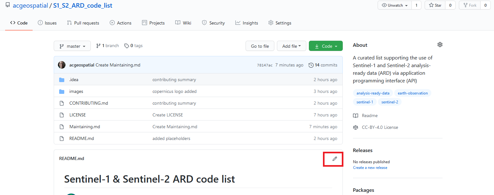 

The screen will be similar to below

 

Click on the highlighted green box to preview any change(s) - shown below

 

To commit the changes make a short commit statement eg

"short description of change(s)"

and <i>optionally</i> add a description

"optional... I added this link / image / sent by x"

 

Inspect the file to see the changes made.

---

## Setting up offline
For anything more than just simple editing it is often easier to work on a version offline and then 'push' it back to the online version. The first part of this document is for a single admin and it is assumed that they will be working on the master branch (the the master copy) of the repo. Often (and espcially when working with code) it is a good idea to make a branch, make changes and then merge back into the master at a later point. This is better for multiple maintainers - see section on [branching](#branching) in this guide. [Branching](#branching) is a great way to manage multiple users editing at the same time. Another good overview of branching documentation is [here](https://git-scm.com/book/en/v2/Git-Branching-Basic-Branching-and-Merging). In the [contributing doc](CONTRIBUTING.md) branching is also mentioned.

To obtain a copy of this repo you can, in the root of the repo, click on the green 'code' button (shown below) and then click download zip. 

 

Save this file and view as needed in text editor or IDE. (more info in [editing software](#editing-software) section). This is fine for inspecting the repo but <b>not recommended for editing and version control</b>

### Editing Software
Before we get into the process of managing the repo its worth considering using a bespoke editor. The following are options
- [notepad ++](https://notepad-plus-plus.org/downloads/)
- [pycharm](https://www.jetbrains.com/pycharm/)
- [atom](https://atom.io/)
- another text editor? (feel free to add)

This guide uses pycharm for its screen shots. It has a preview panel associated with the Readme.md (as do many other editors). The principle of editing remains the same regardless of editor. It is recommended to use one that gives you some colour styling or guidance when making edits, but ultimately it is a personal preference.

### Git
There are two main options for managing your offline editing

1. [GitHub desktop install](https://desktop.github.com/) - A GUI for Windows only
2. [Command line git install](https://git-scm.com/) - Terminal suitable for all types of operating system (os)

They should (at the time of writing they did) both follow a simple gui wizard based installation. Please refer to the respective installation pages for more details

#### GitHub Desktop
Open the program and clone the repo

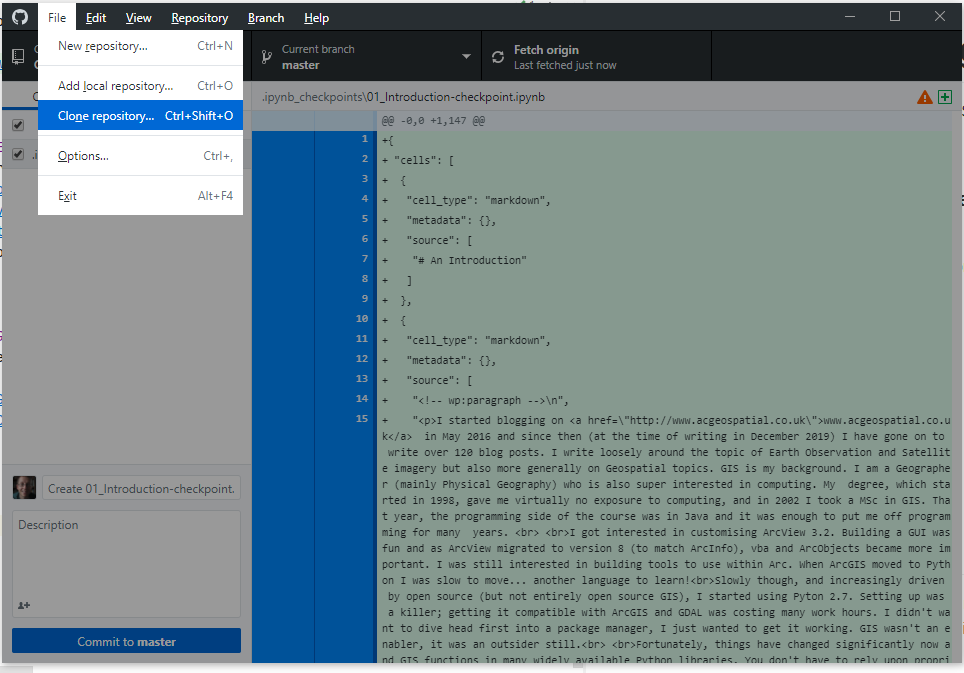 
Navigate to the appropriate location of this repo (note it will be different to screen shot post hand over)

Pleae note the save location in the highlighted black box
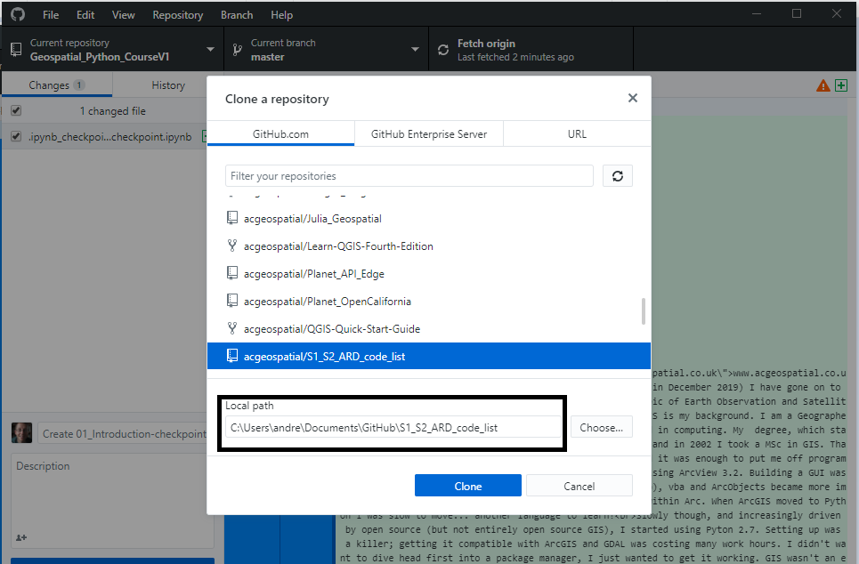 
Cloning in progress

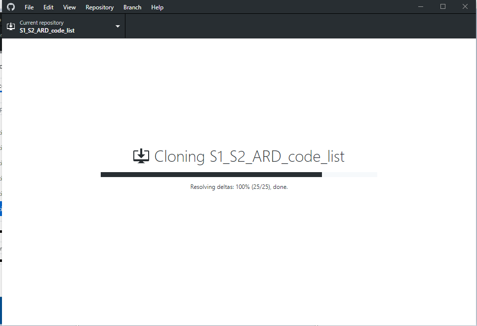 
Current status - no changes at present

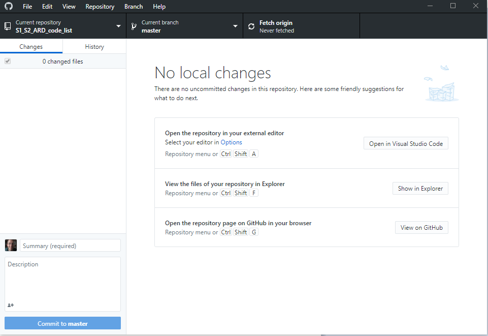 
Make a change to a file (in a text editor) - this is an example

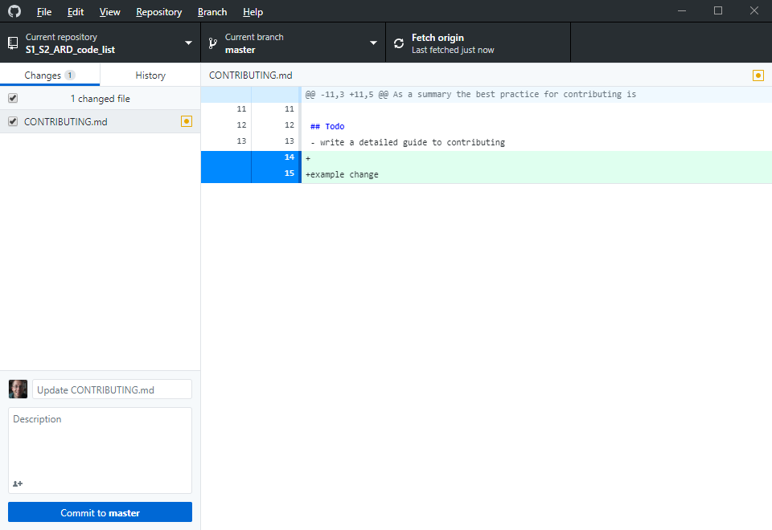 
Add a commit message and click on commit

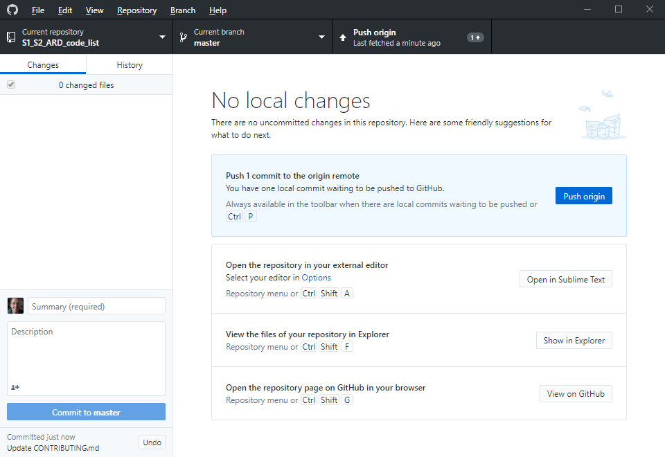 
Finally click on Push Origin to push the (altered) file back to the repo. Inspect the github account online

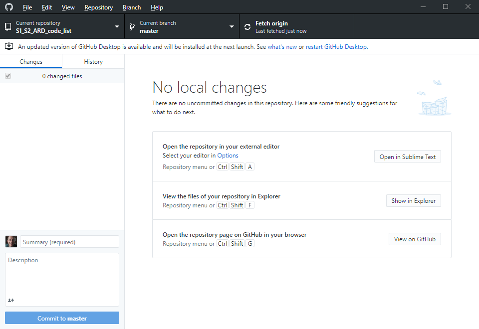
Finally if there are any changes made (perhaps online?) then you can pull/fetch the orgin back to local to ensure you are upto date (again this is an example)

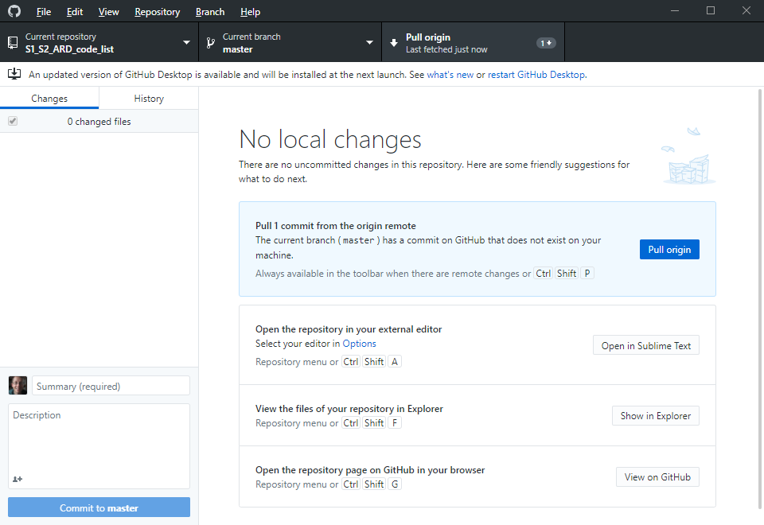

#### Command line git
Git desktop is ok for useage but familiarity with using the command line will enable much faster and provide more control using the power of git. The rest of this guide will assume use of command line / terminal.
You can use the terminal provided in the git install, in this example a standard windows cmd prompt is used.

<b>If this is the first time</b> you are using the terminal then setup your user name and account name by typing

`git config --global user.name "Your name here"`

`git config --global user.email "your_email@example.com"`

This helps when inspecting the history of the repo - finding out who made the change(s). You may/will also be prompted to input your github account password if you are pushing to a repo for the first time

##### Cloning
On the repo root page copy the 'clone with https' link as shown below

Open a command prompt and navigate to the location you would like to clone the repo to and type

`git clone link` (where link is the link from above)

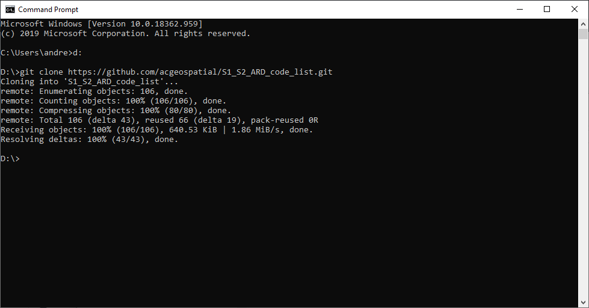
Navigate to the folder and you should find the new repo

#### Making a commit to master

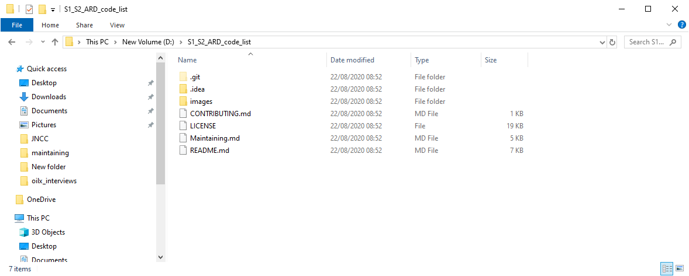
Make a change using an editor. Then type

`git add *` - to add the change to the header of the repo

`git status` - to see the status of the repo

`git commit -m "a commit message"` - to make a commit (locally)

`git status` - to see the status of the repo

`git push` - to push the changes to the repo (master)

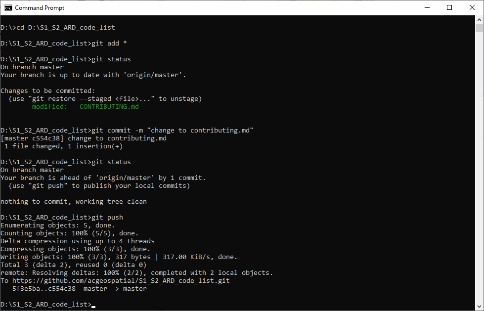
In this final example I have typed

`git pull` - get updates locally from repo

to update our local clone. In this case you would want to do this prior to making any changes

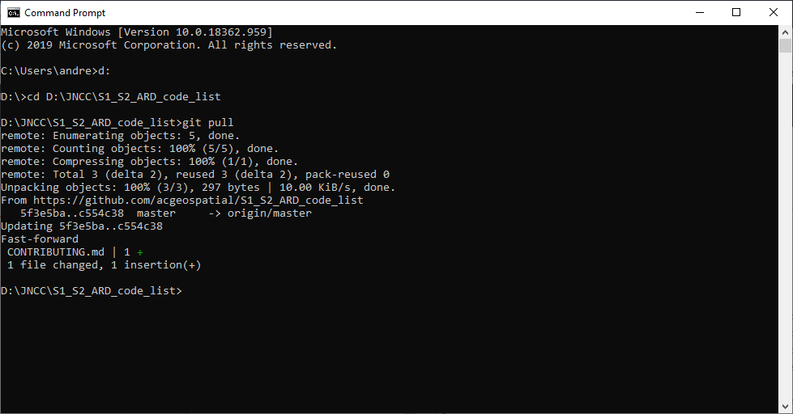

#### Branching
This is a simple guide to branching and merging for more detail please visit [branching docs](https://git-scm.com/book/en/v2/Git-Branching-Basic-Branching-and-Merging)

`git branch` - shows all the branches in repo - just master in this case

`git checkout -b test` - creates a new branch we will work on call test

`git branch` - shows what branches are available and current working one

Make a change to a any file in your repo

`git add *` - add the changes to the header

`git commit -m "a message"` - make a commit statement

Now we are happy with our data we will merge it to the master.

`git checkout master` - working on the master branch again

(at this point consider a `git pull` if there is a chance of a change on original - in this case we know it is just us editing so not needed)

`git merge test` - merge the change on the test branch to the master

`git status` - check that there are no conflicts and that the merge is in the head

`git push` - push the changes back to orginal

`git branch` - check the branch we are workig on

`git branch -d test` - delete the test branch (as we don't need it now)

`git branch` - confirm deletion

All the above steps are shown in screen shot below

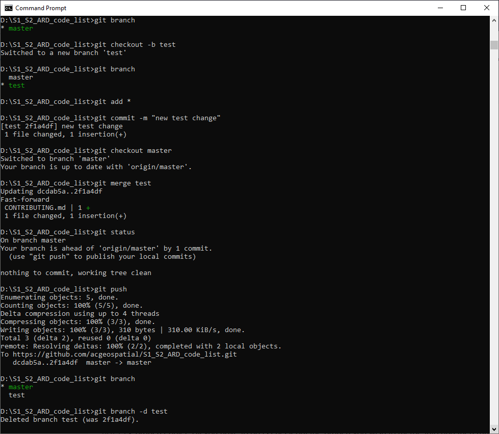

---

### Editing markdown
The best guide to editing markdown in [here](https://github.com/adam-p/markdown-here/wiki/Markdown-Cheatsheet)

A basic understanding of html is helpful flags like `<b>some text</b>` will make text appear like <b>some text</b>

The 3 most common things in this repo are headers, links and images and these are all shown below

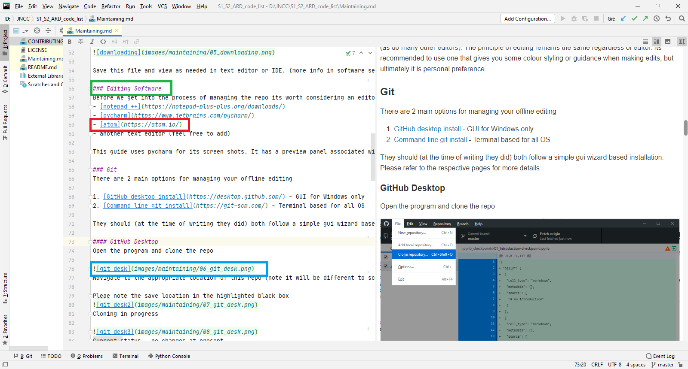

- Headers `# header` or `## header2` 
# header
## header 2
- Links `[link name](http://www.google.com)`

[link name](http://www.google.com)
- Images ``

Lines of test tend to be continous lines. They can be separated with `

` flag but in editors like pycharm carriage return will suffice. Use the preview in whatever editor you have

You can bold text by using `**bold this** ` **bold this** or wrap in html tags `<b> bold that </b>`<b> bold that </b>

---

### Versioning
Versioning in this case will be useful restore to previous version if necessary

To learn more about version control in github visit [here](https://git-scm.com/book/en/v2/Getting-Started-About-Version-Control)

In the terminal you can type

`git log` - gets a list all all the commits

This is perhaps not the easiest visual. You can get more infomation by inspecting the history on the git repo page. Click on the commits link (highlighted below)

You will get back a list of commits and person who has committed them

Click on one to inspect further. Green areas are additions, red areas are deletions. The green box highlighted in the commit hash. Make a note of this if you want to revert to it

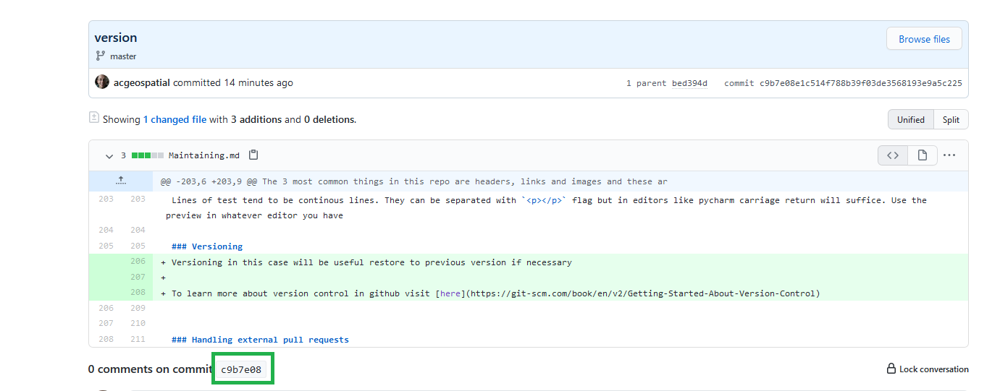

To revert to that commit type at the terminal

`git revert --no-commit c9b7e08..HEAD`

`git commit`

For more information on versioning at the cmd prompt see this excellent [stackoverflow post](https://stackoverflow.com/questions/4114095/how-do-i-revert-a-git-repository-to-a-previous-commit). Sometimes though it is easier to copy the old text and combine manually and make a new commit.

---

### Handling external pull requests
<i>please see [contributing doc](CONTRIBUTING.md) for how to make a contribution.</i>

If someone has forked this repo and made a change they may issue a pull request.

To handle a pull request in this repo (you will probably get email notified of the request)
1. Click Pull requests.
2. Click into the pull request (there maybe several)
3. Inspect it - if happy select merge pull request (if there are no conflicts that you will need to resolve, if not resolve them)
4. Write a comment in the acknowledgement box and close the request

A visual guide is available [here](https://docs.github.com/en/github/collaborating-with-issues-and-pull-requests/merging-a-pull-request)

This process is relatively wizard driven and will become familiar after a short period of time. In the pull request tab you will be able to see previous pull requests. If unsure find another repo and inspect the pull requests tab to see how others handle merging new requests.

